# 🏗️ Notaría Segura v2.1 — Arquitectura Integral

> **Fecha**: 2026-02-16  
> **Objetivo**: Maximizar apalancamiento tecnológico protegiendo margen neto 35%  
> **Pilares**: Identidad · Comunicación · Modularidad
>
> **Estado Actual (2026-02-16)**: 🟡 **Pausado**.
> - ✅ Schema actualizado (`Notary.tier`, `AuditLog`)
> - ⏳ Middleware (`tenant`, `feature-flags`) pendiente
> - ⏳ Integración Clerk/Wasender pendiente

---

## User Review Required

> [!CAUTION]
> **Auth0 destruye el modelo de negocio a largo plazo.** El plan B2B Professional ($150/mo) limita a 5 organizaciones. El Enterprise arranca en $2,500/mo ($30K/año). Con un Tier Básico de $199/mo, **Auth0 consumiría el 75% del ingreso de una sola notaría** en Enterprise. Se recomienda migración inmediata a **Clerk** como solución óptima.

> [!IMPORTANT]
> La implementación de WasenderAPI vía n8n con escaneo QR **no requiere verificación de Meta Business**, lo que reduce el time-to-value de onboarding de semanas a minutos.

---

## PILAR 1: Estrategia de Identidad

### Análisis Comparativo de Costos (proyección 20 notarías)

| Criterio | Auth0 B2B | SuperTokens (Self-hosted) | **Clerk (Recomendado)** |
|---|---|---|---|
| Costo base/mes | $150 (Professional) | $0 (core) | $20 (Pro) |
| Costo 20 orgs | ~$2,500/mo (Enterprise) | $0 (orgs gratis) | $20 + $20 = **$40/mo** |
| MFA | Incluido en Pro | $100/mo mínimo | Incluido en Pro |
| Organizaciones | 5 en Pro, custom en Enterprise | Ilimitadas (self-hosted) | 100 gratis, $1/MRO extra |
| SSO/SAML | 5 conexiones en Pro | Requiere licencia paid | Incluido (metered) |
| Mantenimiento | Cero (SaaS) | Alto (servidor propio) | Cero (SaaS) |
| SDK Frontend React | ✅ `@auth0/auth0-react` | ✅ `supertokens-auth-react` | ✅ `@clerk/clerk-react` |
| Webhook events | Sí | Sí | Sí (muy completo) |
| RLS integration | Via custom claims | Via custom headers | Via custom claims + metadata |

### Veredicto

| Opción | Score | Razón |
|---|---|---|
| ❌ Auth0 | 3/10 | Destruye margen. $30K/año para 20 notarías |
| ⚠️ SuperTokens | 6/10 | Gratis, pero alto costo operacional (hosting, updates, seguridad). Necesitas DevOps dedicado |
| ✅ **Clerk** | 9/10 | **$40/mo para 20 notarías**. Zero-maintenance. Organizations nativas. MFA incluido. $1/org adicional |

### Integración Clerk con RLS

Clerk provee `org_id` en cada JWT. El flujo es:

```mermaid
sequenceDiagram
    participant F as Frontend
    participant C as Clerk
    participant B as Backend (Express)
    participant DB as PostgreSQL

    F->>C: Login (subdomain n18.notariasegura.com)
    C->>F: JWT con org_id + role
    F->>B: Request + Bearer Token
    B->>B: Verify JWT (Clerk SDK)
    B->>B: Map org_id → notaryId (cache)
    B->>DB: SET LOCAL app.current_notary_id = 'uuid'
    B->>DB: Query (RLS filtra automático)
    DB->>B: Solo datos del tenant
    B->>F: Response filtrada
```



### Lazy Migration Strategy (Auth Homemade → Clerk)

Dado que ya tienen usuarios con contraseñas bcrypt en la tabla `users`, la migración será:

1. **Fase A** — Clerk como auth primario para nuevas notarías
2. **Fase B** — Endpoint `POST /api/auth/migration/verify` para que Clerk valide credenciales legacy
3. **Fase C** — Cuando un usuario legacy se loguea exitosamente, se crea en Clerk y se marca como migrado
4. **Fase D** — Después de 90 días, desactivar login legacy

---

## PILAR 2: WhatsApp "Flat Rate" con WasenderAPI + n8n

### Selección de Proveedor

| Proveedor | Costo | Verificación Meta | Mensajes | Integración |
|---|---|---|---|---|
| **WasenderAPI** | $6/mo por número | ❌ No requerida (QR) | Ilimitados | Nodo n8n nativo |
| Twilio WhatsApp | ~$0.05/msg | ✅ Requerida | Pay-per-message | HTTP |
| WhatsApp Cloud API | Gratis primer 1K/mo | ✅ Requerida | Per-conversation | HTTP |

> WasenderAPI es la elección correcta: **sin verificación de Meta**, activación por escaneo QR, $6/mo flat.

### Flujos n8n Diseñados

#### Flujo 1: Factura en PDF Automática

```mermaid
flowchart LR
    A[Webhook: invoice.created] --> B{¿Cliente tiene teléfono?}
    B -->|Sí| C[Generar PDF factura]
    C --> D[WasenderAPI: Enviar PDF + mensaje]
    D --> E[Webhook status → DB]
    B -->|No| F[Log: sin teléfono]
```



**Trigger**: Cuando `Invoice.status` cambia a `PAID` o se crea una factura  
**Nodos n8n**:
1. `Webhook Node` — Recibe evento del backend
2. `HTTP Request` — Genera PDF desde backend (`GET /api/invoices/:id/pdf`)
3. `n8n-nodes-wasenderapi` — Envía PDF como documento WhatsApp
4. `HTTP Request` — Registra en `WhatsAppNotification` tabla

#### Flujo 2: Notificación "Escritura Lista"

**Trigger**: `Document.status` cambia a `LISTO`  
**Template**:
```
📋 *Notaría {{notary.name}}*

Estimado/a {{clientName}}, su escritura está lista para retiro.

📄 Protocolo: {{protocolNumber}}
📍 Dirección: {{notary.address}}
🕐 Horario: Lunes a Viernes 8:00-17:00

Su código de retiro es: *{{codigoRetiro}}*

_Presente este código y su cédula al momento del retiro._
```

#### Flujo 3: Recordatorio de Retiro + Encuesta

**Trigger**: CRON cada 48h para documentos en estado `LISTO` con `fechaListo > 48h`  
**Secuencia**:
1. Primer recordatorio (48h)
2. Segundo recordatorio (7 días) — tono más urgente
3. Tercer recordatorio (15 días) — incluye link de encuesta

**Template encuesta post-retiro**:
```
✅ *¡Gracias por confiar en {{notary.name}}!*

Su escritura ha sido entregada exitosamente.

Nos encantaría conocer su experiencia:
🌟 {{surveyLink}}

Su opinión nos ayuda a mejorar. ¡Gracias!
```

### Seguridad: Webhooks Bidireccionales

El backend expone `POST /api/webhooks/wasender` para recibir:
- `message.sent` → Actualizar `WhatsAppNotification.status = 'SENT'`
- `message.delivered` → Actualizar status `DELIVERED`
- `message.read` → Actualizar status `READ`
- `message.failed` → Actualizar status `FAILED` + `errorMessage`

Validación del webhook con firma HMAC del API Key de WasenderAPI.

---

## PILAR 3: Arquitectura Modular y Feature Flags

### Estructura de Tiers

```mermaid
graph TD
    subgraph "Tier Básico — $199/mo"
        A1[Trazabilidad Documental]
        A2[Facturación / Cartera]
        A3[QR Escrituras]
        A4[Encuestas Satisfacción]
        A5[Mensajes Internos]
    end

    subgraph "Add-ons"
        B1["UAFE Module — +$99/mo"]
        B2["WhatsApp Concierge — +$49/mo"]
        B3["Koinor Sync Agent — +$39/mo"]
    end

    subgraph "Tier Premium — $349/mo"
        C1[Todo Básico]
        C2[UAFE Incluido]
        C3[WhatsApp Concierge Incluido]
        C4[Koinor Sync Incluido]
        C5[Soporte Prioritario]
    end
```



### Estructura del campo `Notary.config` (JSON)

```json
{
  "tier": "BASIC",
  "modules": {
    "uafe": { "enabled": false },
    "whatsapp_concierge": {
      "enabled": true,
      "wasender_api_key": "encrypted:...",
      "wasender_session_id": "sess_abc123",
      "phone_number": "+593999123456",
      "templates": {
        "escritura_lista": true,
        "factura_enviada": true,
        "recordatorio_retiro": true,
        "encuesta_post_retiro": true
      }
    },
    "koinor_sync": {
      "enabled": false,
      "sync_url": null,
      "api_key": null
    }
  },
  "branding": {
    "primaryColor": "#1a365d",
    "logoUrl": "/uploads/n18/logo.png"
  },
  "limits": {
    "maxUsers": 15,
    "maxDocumentsPerMonth": -1
  }
}
```

> [!NOTE]
> Las credenciales sensibles dentro de `config` (API keys de WasenderAPI, Koinor) se almacenan encriptadas usando AES-256-GCM con la variable de entorno `CONFIG_ENCRYPTION_KEY`.

### Feature Flag Middleware

El middleware lee `Notary.config.modules` y inyecta las capacidades activas:

```javascript
// feature-flags.js — Middleware de Feature Flags
export function requireModule(moduleName) {
  return async (req, res, next) => {
    const notary = await getNotaryConfig(req.notaryId); // cached
    const module = notary.config?.modules?.[moduleName];
    
    if (!module?.enabled) {
      return res.status(403).json({
        success: false,
        message: `Módulo "${moduleName}" no está habilitado para esta notaría.`,
        upgradeUrl: '/settings/billing'
      });
    }
    
    req.moduleConfig = module;
    next();
  };
}

// Uso en rutas:
router.post('/uafe/protocolo', requireModule('uafe'), createProtocolo);
router.post('/whatsapp/send', requireModule('whatsapp_concierge'), sendMessage);
```

---

## Proposed Changes

### Prisma Schema Updates

#### [MODIFY] [schema.prisma](file:///d:/notaria-segura-clone/backend/prisma/schema.prisma)

Actualizar `Notary` model para agregar relaciones faltantes y crear modelo `AuditLog`:

```diff
 model Notary {
   id        String   @id @default(uuid())
   name      String
   code      String   @unique
   slug      String   @unique
   ruc       String?  @unique
   address   String?
   city      String?  @default("Quito")
   province  String?  @default("Pichincha")
   phone     String?
   email     String?
   logoUrl   String?
   isActive  Boolean  @default(true)
+  tier      String   @default("BASIC")  // BASIC, PREMIUM, ENTERPRISE
   config    Json?
   createdAt DateTime @default(now())
   updatedAt DateTime @updatedAt

   users     User[]
+  auditLogs AuditLog[]

   @@map("notaries")
 }

+model AuditLog {
+  id          String   @id @default(uuid())
+  notaryId    String?
+  userId      Int?
+  action      String   // LOGIN, LOGOUT, CREATE, UPDATE, DELETE, CONFIG_CHANGE, MODULE_TOGGLE
+  resource    String   // notary, user, document, invoice, config
+  resourceId  String?
+  details     Json?    // { before: {...}, after: {...} }
+  ipAddress   String?
+  userAgent   String?
+  severity    String   @default("INFO") // INFO, WARNING, CRITICAL
+  createdAt   DateTime @default(now())
+  
+  notary      Notary?  @relation(fields: [notaryId], references: [id])
+  
+  @@index([notaryId, createdAt])
+  @@index([action])
+  @@index([resource, resourceId])
+  @@index([severity])
+  @@index([createdAt])
+  @@map("audit_logs")
+}
```

---

### Tenant Middleware

#### [NEW] [tenant-middleware.js](file:///d:/notaria-segura-clone/backend/src/middleware/tenant-middleware.js)

Middleware que inyecta `notaryId` en cada request basado en la sesión del usuario autenticado:

```javascript
import prisma from '../db.js';

// Cache de mapeo org_id → notaryId (TTL: 5 min)
const orgCache = new Map();
const CACHE_TTL = 5 * 60 * 1000;

export async function resolveTenant(req, res, next) {
  try {
    // 1. Extraer notaryId del usuario autenticado
    const userId = req.user?.id;
    if (!userId) {
      return res.status(401).json({ success: false, message: 'Usuario no autenticado' });
    }

    // 2. Buscar el notaryId del usuario
    const user = await prisma.user.findUnique({
      where: { id: userId },
      select: { notaryId: true, role: true }
    });

    // 3. SUPER_ADMIN puede operar cross-tenant
    if (user.role === 'SUPER_ADMIN') {
      req.notaryId = req.headers['x-notary-id'] || null;
      req.isSuperAdmin = true;
      return next();
    }

    if (!user.notaryId) {
      return res.status(403).json({ success: false, message: 'Usuario sin notaría asignada' });
    }

    // 4. Inyectar notaryId en el request
    req.notaryId = user.notaryId;
    req.isSuperAdmin = false;

    // 5. Set RLS variable para PostgreSQL
    await prisma.$executeRawUnsafe(
      `SET LOCAL app.current_notary_id = '${user.notaryId}'`
    );

    next();
  } catch (error) {
    console.error('Error resolviendo tenant:', error);
    res.status(500).json({ success: false, message: 'Error interno de tenant resolution' });
  }
}

// Middleware para proteger acceso solo a su tenant
export function enforceTenant(req, res, next) {
  if (req.isSuperAdmin) return next();
  
  // Verificar que el body no intente escribir en otro tenant
  if (req.body?.notaryId && req.body.notaryId !== req.notaryId) {
    return res.status(403).json({
      success: false,
      message: 'No puedes operar en otra notaría'
    });
  }
  
  // Auto-inyectar notaryId en creates
  if (['POST', 'PUT', 'PATCH'].includes(req.method)) {
    req.body.notaryId = req.notaryId;
  }
  
  next();
}
```

---

### Feature Flags Middleware

#### [NEW] [feature-flags.js](file:///d:/notaria-segura-clone/backend/src/middleware/feature-flags.js)

```javascript
import prisma from '../db.js';

// Cache de config por notaría (TTL: 2 min)
const configCache = new Map();
const CACHE_TTL = 2 * 60 * 1000;

async function getNotaryConfig(notaryId) {
  const cached = configCache.get(notaryId);
  if (cached && Date.now() - cached.ts < CACHE_TTL) return cached.data;
  
  const notary = await prisma.notary.findUnique({
    where: { id: notaryId },
    select: { config: true, tier: true }
  });
  
  const data = { config: notary?.config || {}, tier: notary?.tier || 'BASIC' };
  configCache.set(notaryId, { data, ts: Date.now() });
  return data;
}

export function requireModule(moduleName) {
  return async (req, res, next) => {
    if (req.isSuperAdmin) return next();
    
    if (!req.notaryId) {
      return res.status(403).json({ success: false, message: 'Tenant no resuelto' });
    }

    const { config } = await getNotaryConfig(req.notaryId);
    const mod = config?.modules?.[moduleName];
    
    if (!mod?.enabled) {
      return res.status(403).json({
        success: false,
        code: 'MODULE_DISABLED',
        message: `El módulo "${moduleName}" no está habilitado para esta notaría`,
        upgradeUrl: '/settings/billing'
      });
    }
    
    req.moduleConfig = mod;
    next();
  };
}

export function invalidateConfigCache(notaryId) {
  configCache.delete(notaryId);
}
```

---

### Audit Logger

#### [NEW] [audit-service.js](file:///d:/notaria-segura-clone/backend/src/services/audit-service.js)

Log inmutable para el Super Admin:

```javascript
import prisma from '../db.js';

export async function logAudit({ notaryId, userId, action, resource, resourceId, details, req, severity = 'INFO' }) {
  try {
    await prisma.auditLog.create({
      data: {
        notaryId,
        userId,
        action,
        resource,
        resourceId,
        details,
        ipAddress: req?.ip || req?.headers?.['x-forwarded-for'],
        userAgent: req?.headers?.['user-agent'],
        severity
      }
    });
  } catch (error) {
    // Never let audit logging break the main flow
    console.error('Audit log failed:', error.message);
  }
}
```

---

### Webhook Handler for WasenderAPI

#### [NEW] [wasender-webhook-controller.js](file:///d:/notaria-segura-clone/backend/src/controllers/wasender-webhook-controller.js)

```javascript
import prisma from '../db.js';
import crypto from 'crypto';

export async function handleWasenderWebhook(req, res) {
  // 1. Verify webhook signature
  const signature = req.headers['x-wasender-signature'];
  const expectedSig = crypto
    .createHmac('sha256', process.env.WASENDER_WEBHOOK_SECRET)
    .update(JSON.stringify(req.body))
    .digest('hex');
  
  if (signature !== expectedSig) {
    return res.status(401).json({ error: 'Invalid signature' });
  }

  const { event, data } = req.body;

  // 2. Map event to notification status
  const statusMap = {
    'message.sent': 'SENT',
    'message.delivered': 'DELIVERED', 
    'message.read': 'READ',
    'message.failed': 'FAILED'
  };

  const status = statusMap[event];
  if (!status || !data?.messageId) {
    return res.status(200).json({ received: true });
  }

  // 3. Update WhatsAppNotification
  await prisma.whatsAppNotification.updateMany({
    where: { messageId: data.messageId },
    data: {
      status,
      ...(status === 'SENT' && { sentAt: new Date() }),
      ...(status === 'FAILED' && { errorMessage: data.error || 'Unknown error' })
    }
  });

  res.status(200).json({ received: true });
}
```

---

### RLS SQL Migration

#### [NEW] [rls_policies.sql](file:///d:/notaria-segura-clone/backend/prisma/migrations/manual/rls_policies.sql)

```sql
-- Enable RLS on tenant-scoped tables
ALTER TABLE users ENABLE ROW LEVEL SECURITY;
ALTER TABLE documents ENABLE ROW LEVEL SECURITY;
ALTER TABLE invoices ENABLE ROW LEVEL SECURITY;
ALTER TABLE payments ENABLE ROW LEVEL SECURITY;

-- Policy: users can only see their own tenant's data
CREATE POLICY tenant_isolation_users ON users
  USING (
    "notaryId" = current_setting('app.current_notary_id', true)
    OR current_setting('app.is_super_admin', true) = 'true'
  );

-- Policy: documents (requires notaryId column first)
-- CREATE POLICY tenant_isolation_documents ON documents
--   USING ("notaryId" = current_setting('app.current_notary_id', true)
--          OR current_setting('app.is_super_admin', true) = 'true');

-- Audit logs: append-only, no UPDATE/DELETE
ALTER TABLE audit_logs ENABLE ROW LEVEL SECURITY;
CREATE POLICY audit_append_only ON audit_logs
  FOR INSERT WITH CHECK (true);
CREATE POLICY audit_read_super_admin ON audit_logs
  FOR SELECT USING (
    current_setting('app.is_super_admin', true) = 'true'
    OR "notaryId" = current_setting('app.current_notary_id', true)
  );
```

---

## Resumen de Costos Operacionales (20 Notarías)

| Servicio | Costo Mensual | Notas |
|---|---|---|
| Clerk Pro + 20 orgs | $40 | 100 MROs gratis, luego $1/MRO |
| WasenderAPI × 20 | $120 | $6/número × 20 notarías |
| n8n Cloud (Starter) | $24 | 2,500 ejecuciones. Self-host = $0 |
| Railway (Backend) | $20 | Actual |
| **Total infraestructura auth+comms** | **$204** | |
| **Ingreso 20 notarías (Básico)** | **$3,980** | 20 × $199 |
| **Margen neto** | **~95%** en auth+comms | Objetivo 35% cumplido holgadamente |

---

## Verification Plan

### Automated Tests

> [!NOTE]
> El proyecto actual tiene 5 archivos de test en `backend/tests/`. Se validarán los nuevos middleware con tests unitarios.

1. **Test tenant-middleware**: `npm test -- --grep "tenant"` — Verificar que `req.notaryId` se inyecta correctamente, que SUPER_ADMIN puede cross-tenant, y que usuarios sin notaría son rechazados
2. **Test feature-flags**: `npm test -- --grep "feature"` — Verificar que módulos deshabilitados retornan 403, que módulos habilitados pasan, y que el cache se invalida correctamente
3. **Test audit-service**: `npm test -- --grep "audit"` — Verificar que los logs se crean y que nunca fallan silenciosamente

### Manual Verification
1. **Verificar que `Notary.config` acepta el JSON propuesto**: Usar Prisma Studio (`npx prisma studio`) para editar manualmente un registro de notaría y confirmar que el JSON se guarda/lee correctamente
2. **Pedir al usuario confirmar integración con n8n**: Verificar que la instancia n8n del proyecto puede instalar `n8n-nodes-wasenderapi` desde el panel de Community Nodes
3. **Verificar RLS**: Ejecutar query directa a PostgreSQL con `SET app.current_notary_id = 'uuid-notaria-18'` y confirmar que solo retorna datos de esa notaría
