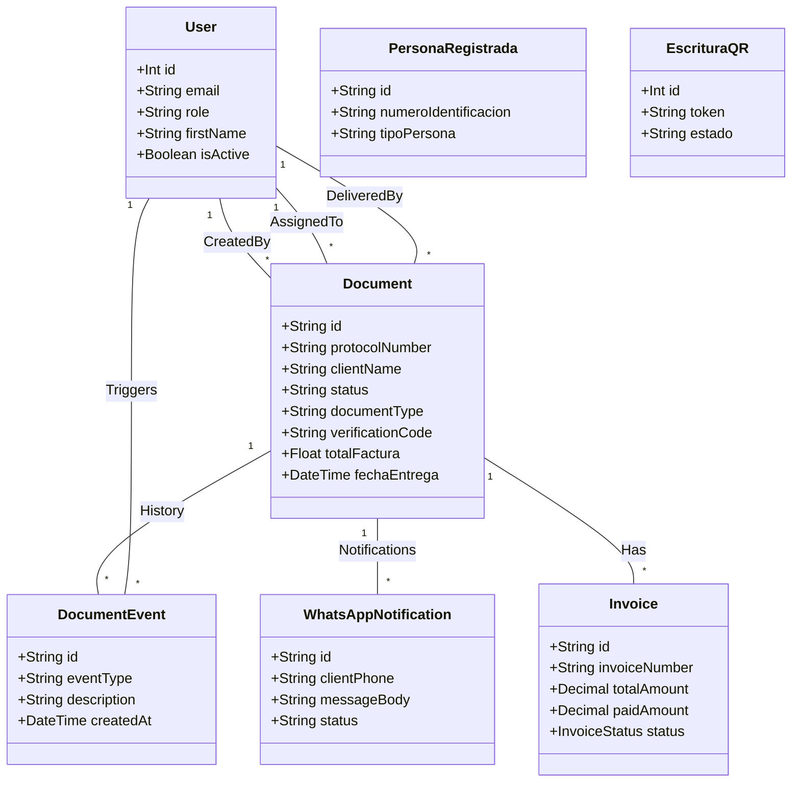

# Bases de Ingeniería de Software - Notaría Segura

Este documento establece las bases arquitectónicas y de diseño del sistema "Notaría Segura", generadas tras una auditoría técnica del repositorio.

## 1. Resumen de Módulos

El sistema se divide en los siguientes módulos funcionales:

*   **Core / Gestión Documental**: Es el núcleo del sistema. Maneja el ciclo de vida del trámite notarial desde la ingesta (XML) hasta la entrega. Responsable de la máquina de estados de los documentos (`PENDIENTE`, `EN_PROCESO`, `LISTO`, `ENTREGADO`).
*   **Autenticación y Control de Acceso (IAM)**: Gestiona usuarios, sesiones (JWT) y roles (`ADMIN`, `CAJA`, `MATRIZADOR`, `RECEPCION`, `ARCHIVO`). Implementa la seguridad a nivel de rutas y lógica de negocio.
*   **Facturación y Cobranza (Billing/CXC)**: Sincroniza y vincula facturas electrónicas con los trámites documentales. Gestiona estados de pago, abonos y reportes de Cuentas por Cobrar.
*   **Notificaciones y Comunicación**: Módulo encargado de la interacción con el cliente final a través de WhatsApp. Gestiona plantillas, envío de códigos de verificación y alertas de estado.
*   **Recepción y Entrega**: Interfaz especializada para el personal de ventanilla. Permite la búsqueda rápida, validación de códigos de retiro y registro de la entrega física (quién retira, cuándo y cómo).
*   **Cumplimiento (UAFE)**: Módulo especializado para la gestión de formularios y protocolos requeridos por la Unidad de Análisis Financiero y Económico. Maneja datos sensibles de comparecientes.
*   **Archivo y Digitalización**: Gestión del acervo documental físico y digital. Incluye la generación y validación de códigos QR para escrituras públicas.
*   **Servicios Públicos**: Interfaces de acceso público para validación de documentos (QR) y encuestas de satisfacción.

## 2. Arquitectura de Alto Nivel

El sistema sigue un patrón de arquitectura **Cliente-Servidor (Multicapa)**.

*   **Frontend (Cliente)**: Aplicación SPA (Single Page Application) construida con **React** y **Vite**. Utiliza **Material UI** para la interfaz, **Zustand** para la gestión del estado global y **Axios** para la comunicación HTTP.
*   **Backend (Servidor)**: API RESTful construida sobre **Node.js** y **Express**.
*   **Persistencia**: Base de datos Relacional **PostgreSQL**, gestionada a través del ORM **Prisma**.

### Flujo de Datos

1.  **Interacción**: El usuario interactúa con la interfaz React.
2.  **Solicitud**: El Frontend envía peticiones HTTP (JSON) al Backend.
3.  **Ruteo y Control**: Express enruta la petición al Controlador correspondiente.
4.  **Lógica**: El Controlador (a veces apoyado por Servicios) ejecuta la lógica de negocio, validaciones y verificación de permisos.
5.  **Datos**: Prisma traduce las operaciones a SQL y consulta PostgreSQL.
6.  **Respuesta**: Los datos retornan al Frontend para actualizar la vista.

## 3. Diagrama de Clases (Modelo de Dominio)

A continuación se presentan las entidades principales y sus relaciones, basadas en el esquema de base de datos actual.

## 4. Casos de Uso Principales

### Flujo 1: Ingesta y Asignación (Rol: CAJA)
1.  El usuario **Caja** sube un lote de archivos XML al sistema.
2.  El sistema parsea los XML, extrae metadatos (Cliente, Protocolo, Factura) y crea los registros `Document`.
3.  El sistema asigna automáticamente el documento a un **Matrizador** basado en el nombre detectado en el XML o reglas predefinidas.

### Flujo 2: Procesamiento (Rol: MATRIZADOR)
1.  El **Matrizador** ve su lista de documentos "Pendientes" o "En Proceso".
2.  Realiza el trabajo notarial físico/digital.
3.  Cambia el estado del documento a `LISTO`.
4.  El sistema genera un **Código de Verificación** único.
5.  (Opcional) El sistema envía una notificación WhatsApp al cliente con el código.

### Flujo 3: Entrega en Ventanilla (Rol: RECEPCIÓN)
1.  El **Cliente** llega y presenta su código o cédula.
2.  **Recepción** busca el trámite en el sistema.
3.  Verifica que el estado sea `LISTO`.
4.  Registra la entrega ingresando quién retira y validando el código.
5.  El sistema cambia el estado a `ENTREGADO` y registra la fecha/hora y usuario responsable.

## 5. Análisis de Deuda Técnica

Durante la auditoría se identificaron las siguientes áreas de mejora y fragilidad:

### 1. Controladores "Obesos" (Fat Controllers)
*   **Problema**: El archivo `document-controller.js` tiene más de 2000 líneas. Contiene lógica de presentación, lógica de negocio, construcción de mensajes de WhatsApp, lógica de "reparación" de historial (healing) y acceso a datos, todo mezclado.
*   **Riesgo**: Dificulta el mantenimiento, el testing unitario y la reutilización de código.
*   **Recomendación**: Extraer la lógica de negocio a Servicios dedicados (ej: `NotificationService`, `DocumentLifecycleService`, `HistoryService`).

### 2. Gestión de Permisos Dispersa
*   **Problema**: La verificación de roles se hace manualmente en cada método del controlador (`if (req.user.role !== 'CAJA') ...`).
*   **Riesgo**: Es fácil olvidar una verificación al agregar nuevos endpoints, creando brechas de seguridad.
*   **Recomendación**: Implementar un middleware de autorización robusto o un sistema de políticas (ej: CASL) centralizado.

### 3. Valores "Hardcoded"
*   **Problema**: Las plantillas de mensajes de WhatsApp y textos de lógica de negocio se construyen mediante concatenación de strings dentro del código.
*   **Riesgo**: Cambiar un texto requiere un despliegue de código. Dificulta la internacionalización o configuración dinámica.
*   **Recomendación**: Mover las plantillas a la base de datos (ya existe `WhatsAppTemplate`, usarlo consistentemente) o archivos de configuración.

### 4. Inconsistencia de Datos Histórica
*   **Problema**: Se detectó código defensivo complejo (`synthetic events`) para "inventar" eventos de historial cuando estos faltan en la base de datos.
*   **Riesgo**: Indica que en el pasado hubo operaciones que no registraron auditoría correctamente, lo que compromete la trazabilidad real.
*   **Recomendación**: Ejecutar scripts de migración de datos para sanear la base de datos una sola vez, en lugar de mantener lógica de "parcheo" en tiempo de ejecución.

### 5. Cobertura de Tests
*   **Problema**: La estructura del proyecto sugiere una falta de pruebas unitarias y de integración automatizadas para el backend.
*   **Riesgo**: Alto riesgo de regresiones al refactorizar o añadir nuevas funcionalidades.
