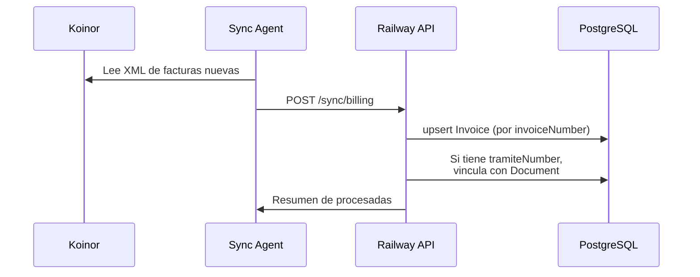
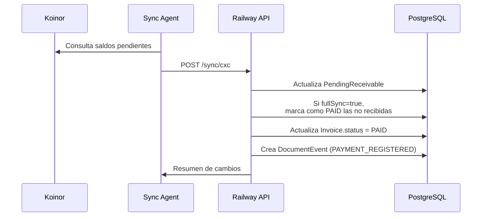

# 🔄 Arquitectura de Sincronización

## Visión General

El sistema utiliza una arquitectura híbrida donde el backend en Railway se sincroniza con el sistema Koinor local a través de un Sync Agent.

```
┌─────────────────┐         ┌──────────────────┐         ┌─────────────────┐
│   Koinor Local  │ ───────▶│   Sync Agent     │ ───────▶│  Railway API    │
│  (MySQL/CSV)    │         │  (Node.js local) │         │  (PostgreSQL)   │
└─────────────────┘         └──────────────────┘         └─────────────────┘
                                   │                             │
                                   ▼                             ▼
                            ┌──────────────┐              ┌──────────────┐
                            │  Archivos    │              │   Frontend   │
                            │   XML/CSV    │              │   (React)    │
                            └──────────────┘              └──────────────┘
```

---

## 📊 Tablas de Sincronización

### 1. Invoice (Facturas - Billing Sync)

**Origen:** Archivos XML de facturas electrónicas
**Proceso:** Sync incremental por timestamp

```javascript
// Campos clave
{
  invoiceNumber: "001-002-000123456",
  status: "PENDING" | "PAID" | "PARTIAL",
  totalAmount: 100.00,
  paidAmount: 0,           // ← Actualizado por CXC sync
  documentId: 123,         // ← Vinculación con documento
  koinorModifiedAt: Date,  // ← Para sync incremental
  lastSyncAt: Date
}
```

### 2. PendingReceivable (CXC - Cuentas por Cobrar)

**Origen:** Exportación de saldos pendientes de Koinor
**Proceso:** Sync completo (full sync)

```javascript
// Campos clave
{
  invoiceNumber: "001-002-000123456",
  status: "PENDING" | "PAID",
  totalAmount: 100.00,
  pendingAmount: 0,        // ← Si es 0 = pagado
  documentId: 123,
  lastSyncAt: Date
}
```

---

## 🔄 Flujos de Sincronización

### Sync 1: Billing (Facturas)



**Endpoint:** `POST /sync/billing`

**Lógica clave:**
- Usa `koinorModifiedAt` para sync incremental
- Solo actualiza si el registro es más reciente
- Crea vinculación Document-Invoice automáticamente

### Sync 2: CXC (Cuentas por Cobrar)



**Endpoint:** `POST /sync/cxc`

**Lógica clave:**
- Full sync: todas las facturas pendientes
- Facturas no en lista = marcadas como PAID
- Sincroniza tanto PendingReceivable como Invoice
- Crea eventos de pago en historial de documentos

---

## 🎯 Estados de Factura

### Diagrama de Estados

```
                    ┌─────────────┐
                    │   IMPORTED  │
                    └──────┬──────┘
                           │
              ┌────────────┼────────────┐
              ▼            ▼            ▼
        ┌─────────┐  ┌─────────┐  ┌─────────┐
        │ PENDING │  │ PARTIAL │  │  PAID   │
        └────┬────┘  └────┬────┘  └────┬────┘
             │            │            │
             └────────────┴────────────┘
                          │
                          ▼
                    ┌─────────────┐
                    │ CANCELLED   │
                    └─────────────┘
```

### Cálculo de Estado de Pago

```javascript
// Lógica usada en endpoints de documentos
const paymentsTotal = invoice.payments.reduce((sum, p) => sum + Number(p.amount), 0);
const syncedPaidAmount = Number(invoice.paidAmount || 0);
const totalPaid = Math.max(paymentsTotal, syncedPaidAmount);

const status = totalPaid >= invoice.totalAmount ? 'PAID' 
             : totalPaid > 0 ? 'PARTIAL' 
             : 'PENDING';
```

---

## ⚠️ Consideraciones Importantes

### 1. Doble Fuente de Pagos

Los pagos pueden venir de:
- **Tabla `payments`**: Pagos registrados manualmente en el sistema
- **Campo `paidAmount`**: Pagos sincronizados desde Koinor

**Solución:** Usar `Math.max(paymentsTotal, syncedPaidAmount)` para calcular el total pagado.

### 2. Sincronización Cruzada

Cuando CXC marca una factura como PAID:
```javascript
// 1. Actualiza PendingReceivable
// 2. Busca Invoice correspondiente
// 3. Actualiza Invoice.status = PAID
// 4. Actualiza Document.pagoConfirmado = true
// 5. Crea DocumentEvent (PAYMENT_REGISTERED)
```

### 3. Protección contra Falsos Positivos

El sync de CXC puede fallar al procesar registros. Implementamos:

```javascript
const failedInvoiceNumbers = [];

// Si falla un registro, se agrega a la lista
if (error) {
  failedInvoiceNumbers.push(invoiceNumber);
}

// Al marcar como PAID, excluimos los fallidos
const excludeFromMarkAsPaid = [
  ...receivedInvoiceNumbers, 
  ...failedInvoiceNumbers
];
```

---

## 📡 Endpoints de Sincronización

### POST /sync/billing
Sincroniza facturas desde archivos XML.

**Body:**
```json
{
  "invoices": [
    {
      "invoiceNumber": "001-002-000123456",
      "clientName": "Cliente Ejemplo",
      "totalAmount": 100.00,
      "issueDate": "2025-01-15",
      "tramiteNumber": "001-2025-000123"
    }
  ],
  "sourceFile": "facturas_20250115.xml"
}
```

### POST /sync/cxc
Sincroniza saldos de cuentas por cobrar.

**Body:**
```json
{
  "receivables": [
    {
      "invoiceNumber": "001-002-000123456",
      "clientName": "Cliente Ejemplo",
      "totalAmount": 100.00,
      "pendingAmount": 0
    }
  ],
  "fullSync": true,
  "syncDate": "2025-02-06T10:00:00Z"
}
```

---

## 🛠️ Scripts de Diagnóstico

| Script | Descripción | Uso |
|--------|-------------|-----|
| `detect-invoice-desfase.js` | Detecta diferencias entre Invoice y PendingReceivable | `node scripts/detect-invoice-desfase.js` |
| `fix-all-invoice-desfase.js` | Corrige desfases detectados | `node scripts/fix-all-invoice-desfase.js --apply` |
| `sync-invoice-from-pending.js` | Sincroniza Invoice desde PendingReceivable | `node scripts/sync-invoice-from-pending.js` |
| `diagnose-factura.js` | Diagnóstico detallado de una factura | `node scripts/diagnose-factura.js 001-002-000123456` |
| `add-payment-events-to-history.js` | Agrega eventos de pago al historial | `node scripts/add-payment-events-to-history.js` |

---

## 📊 Monitoreo

### Métricas Importantes

1. **Facturas sin documento vinculado**
2. **Desfase Invoice vs PendingReceivable**
3. **Facturas PAID sin evento de pago**
4. **Tiempo entre sync y actualización en UI**

### Logs de Sync

```
[BILLING_SYNC] Procesadas: 150, Nuevas: 10, Actualizadas: 140
[CXC_SYNC] Recibidas: 2000, Marcadas PAID: 50
[PAYMENT_EVENT] Creado evento para documento 123, factura 001-002-000123456
```

---

*Última actualización: Febrero 2025*
