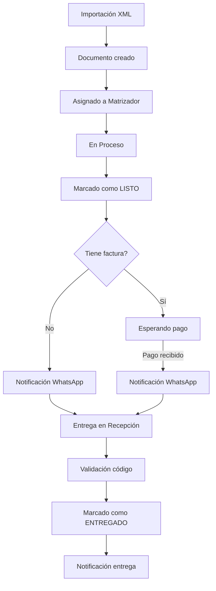
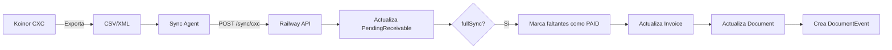

# 📘 Guía Técnica - Sistema de Trazabilidad Notarial

## Resumen Ejecutivo

Sistema web para notaría que rastrea documentos desde creación hasta entrega, utilizando códigos de barras existentes y códigos de verificación WhatsApp.

---

## 🏗️ Arquitectura del Sistema

### Stack Tecnológico

```
┌─────────────────────────────────────────────────────────────┐
│                         FRONTEND                             │
│  React 18 + Vite + Material UI 5 + React Router 6           │
│  State: Context API + Hooks                                  │
│  HTTP Client: Axios                                          │
└───────────────────────┬─────────────────────────────────────┘
                        │ HTTPS/JSON
┌───────────────────────▼─────────────────────────────────────┐
│                         BACKEND                              │
│  Node.js 20 + Express 4 + Prisma ORM                        │
│  Auth: JWT + bcrypt                                          │
│  Validation: express-validator                               │
└───────────────────────┬─────────────────────────────────────┘
                        │ PostgreSQL
┌───────────────────────▼─────────────────────────────────────┐
│                      BASE DE DATOS                           │
│  PostgreSQL 15 (Railway)                                    │
│  Backup: Automático diario                                  │
└─────────────────────────────────────────────────────────────┘
```

### Infraestructura

| Ambiente | Plataforma | URL | Branch |
|----------|------------|-----|--------|
| Producción | Railway | https://notaria-segura.railway.app | `main` |
| Staging | Railway | https://notaria-segura-staging.railway.app | `staging` |

---

## 📁 Estructura del Proyecto

```
notaria-segura/
├── backend/
│   ├── src/
│   │   ├── controllers/      # Lógica de negocio
│   │   ├── routes/           # Definición de endpoints
│   │   ├── middleware/       # Auth, validaciones
│   │   ├── services/         # Servicios reutilizables
│   │   └── utils/            # Utilidades
│   └── prisma/
│       └── schema.prisma     # Esquema de base de datos
├── frontend/
│   └── src/
│       ├── components/       # Componentes React
│       ├── pages/            # Páginas por rol
│       ├── hooks/            # Custom hooks
│       ├── services/         # Llamadas API
│       └── contexts/         # Context providers
├── docs/                     # Documentación
├── scripts/                  # Scripts de mantenimiento
└── sync-agent/               # Agente de sincronización
```

---

## 👥 Roles del Sistema

| Rol | Permisos | Descripción |
|-----|----------|-------------|
| **ADMIN** | Full access | Supervisión completa, gestión de usuarios |
| **CAJA** | Finanzas, reportes | Gestión financiera, importación XMLs |
| **MATRIZADOR** | Documentos, notificaciones | Procesamiento documentos, cambio de estados |
| **RECEPCIÓN** | Entregas, consultas | Entrega documentos, códigos verificación |
| **ARCHIVO** | Supervisión | Supervisión de documentos, información general |

---

## 📊 Modelo de Datos Principal

### Document (Documentos)

```prisma
model Document {
  id                    Int       @id @default(autoincrement())
  protocolNumber        String?   // Número de protocolo
  tramiteNumber         String?   // Número de trámite (relaciona con factura)
  clientName            String    // Nombre del cliente
  documentType          String    // Tipo de documento
  status                DocumentStatus // CREATED, IN_PROGRESS, LISTO, ENTREGADO
  
  // Relaciones
  matrizadorId          Int?      // Usuario matrizador asignado
  verificationCode      String?   // Código 4 dígitos para entrega
  
  // Campos de facturación
  numeroFactura         String?   // Número de factura (copia cache)
  pagoConfirmado        Boolean   @default(false)
  
  // Relaciones
  invoices              Invoice[]
  events                DocumentEvent[]
  
  createdAt             DateTime  @default(now())
  updatedAt             DateTime  @updatedAt
}
```

### Invoice (Facturas)

```prisma
model Invoice {
  id                Int           @id @default(autoincrement())
  invoiceNumber     String        @unique
  invoiceNumberRaw  String?       // Número sin formato
  clientName        String
  totalAmount       Decimal       @db.Decimal(10, 2)
  paidAmount        Decimal?      @db.Decimal(10, 2) // Sincronizado desde Koinor
  status            InvoiceStatus // PENDING, PARTIAL, PAID
  
  // Relaciones
  documentId        Int?
  document          Document?     @relation(fields: [documentId], references: [id])
  payments          Payment[]
  
  // Sync metadata
  koinorModifiedAt  DateTime?     // Para sync incremental
  lastSyncAt        DateTime?
  syncSource        String?       // KOINOR_SYNC_BILLING, KOINOR_SYNC_CXC
  
  createdAt         DateTime      @default(now())
  updatedAt         DateTime      @updatedAt
}
```

### PendingReceivable (CXC)

```prisma
model PendingReceivable {
  id              Int       @id @default(autoincrement())
  invoiceNumber   String    @unique
  clientName      String
  totalAmount     Decimal   @db.Decimal(10, 2)
  pendingAmount   Decimal   @db.Decimal(10, 2)
  status          String    // PENDING, PAID
  
  // Relaciones
  documentId      Int?
  document        Document? @relation(fields: [documentId], references: [id])
  
  lastSyncAt      DateTime
  
  @@index([status])
  @@index([documentId])
}
```

### DocumentEvent (Historial)

```prisma
model DocumentEvent {
  id                Int      @id @default(autoincrement())
  documentId        Int
  document          Document @relation(fields: [documentId], references: [id])
  userId            Int      // Usuario que realizó la acción
  eventType         String   // STATUS_CHANGE, DELIVERY, PAYMENT_REGISTERED, etc.
  description       String   // Descripción legible
  details           String?  // JSON con detalles adicionales
  
  // Campos específicos para entregas
  personaRetiro     String?
  cedulaRetiro      String?
  metodoVerificacion String?
  
  createdAt         DateTime @default(now())
  
  @@index([documentId])
  @@index([eventType])
}
```

---

## 🔄 Flujos Principales

### 1. Flujo de Documento Completo



### 2. Flujo de Sincronización de Pagos



---

## 🔐 Autenticación y Autorización

### JWT Structure

```javascript
{
  "userId": 123,
  "email": "usuario@ejemplo.com",
  "role": "MATRIZADOR",
  "iat": 1707168000,
  "exp": 1707171600
}
```

### Middleware de Autorización

```javascript
const requireRoles = (...roles) => (req, res, next) => {
  if (!roles.includes(req.user.role)) {
    return res.status(403).json({ error: 'Acceso denegado' });
  }
  next();
};

// Uso
router.post('/admin/users', 
  authenticate, 
  requireRoles('ADMIN'), 
  createUser
);
```

---

## 📡 API Endpoints Principales

### Documentos

| Método | Endpoint | Descripción | Roles |
|--------|----------|-------------|-------|
| GET | `/documents` | Listar documentos | Todos |
| GET | `/documents/:id` | Detalle de documento | Todos |
| POST | `/documents` | Crear documento | ADMIN, CAJA |
| PUT | `/documents/:id` | Actualizar documento | ADMIN, MATRIZADOR |
| POST | `/documents/:id/assign` | Asignar matrizador | ADMIN |
| POST | `/documents/:id/status` | Cambiar estado | MATRIZADOR |

### Facturación

| Método | Endpoint | Descripción | Roles |
|--------|----------|-------------|-------|
| GET | `/billing/invoices` | Listar facturas | Todos |
| GET | `/billing/invoices/:id` | Detalle de factura | Todos |
| GET | `/billing/documents/:id/payment-status` | Estado de pago | Todos |
| POST | `/sync/billing` | Sync de facturas | System |
| POST | `/sync/cxc` | Sync de CXC | System |

### Sincronización

| Método | Endpoint | Descripción |
|--------|----------|-------------|
| POST | `/sync/billing` | Sincroniza facturas desde XML |
| POST | `/sync/cxc` | Sincroniza saldos de CXC |

---

## 🧪 Testing

### Tests Unitarios

```bash
# Backend
cd backend
npm test

# Frontend
cd frontend
npm test
```

### Tests de Integración

```bash
# Probar sync
curl -X POST https://api.railway.app/sync/billing \
  -H "Authorization: Bearer $SYSTEM_TOKEN" \
  -d @test-data/invoices.json

# Verificar factura
curl https://api.railway.app/billing/invoices/001-002-000123456 \
  -H "Authorization: Bearer $USER_TOKEN"
```

---

## 🚀 Deployment

### Flujo de Deploy

```bash
# 1. Commit y push a staging
git add .
git commit -m "feat: descripción"
git push origin staging

# 2. Verificar en staging
# https://notaria-segura-staging.railway.app

# 3. Merge a main
git checkout main
git merge staging
git push origin main

# 4. Verificar en producción
# https://notaria-segura.railway.app
```

### Variables de Entorno

```bash
# Backend (.env)
NODE_ENV=production
PORT=3000
DATABASE_URL=postgresql://...
JWT_SECRET=...
CORS_ORIGIN=https://notaria-segura.railway.app

# Sync Agent (.env)
API_URL=https://notaria-segura.railway.app
API_TOKEN=...
KOINOR_DB_HOST=...
KOINOR_DB_USER=...
KOINOR_DB_PASS=...
```

---

## 📈 Monitoreo y Logs

### Logs de Aplicación

```bash
# Ver logs en Railway
railway logs

# Filtrar por servicio
railway logs --service backend
```

### Métricas Importantes

1. **Tiempo de respuesta API** < 500ms
2. **Tasa de error** < 1%
3. **Sync latency** < 5 minutos
4. **Disponibilidad** > 99.5%

---

## 🛠️ Mantenimiento

### Tareas Diarias

- [ ] Verificar logs de errores
- [ ] Revisar estado de sincronización
- [ ] Backup de base de datos (automático)

### Tareas Semanales

- [ ] Revisar desfases Invoice vs PendingReceivable
- [ ] Analizar documentos sin factura
- [ ] Revisar métricas de rendimiento

### Tareas Mensuales

- [ ] Actualizar dependencias
- [ ] Revisar y rotar tokens
- [ ] Limpiar logs antiguos
- [ ] Verificar integridad de datos

---

## 📚 Documentación Relacionada

- [SYNC-ARCHITECTURE.md](./SYNC-ARCHITECTURE.md) - Arquitectura de sincronización
- [TROUBLESHOOTING.md](./TROUBLESHOOTING.md) - Guía de solución de problemas
- [MODULO_FACTURACION_PAGOS.md](./MODULO_FACTURACION_PAGOS.md) - Facturación
- [INSTRUCCIONES_CXC_PENDING_RECEIVABLES.md](./INSTRUCCIONES_CXC_PENDING_RECEIVABLES.md) - CXC

---

*Última actualización: Febrero 2025*
