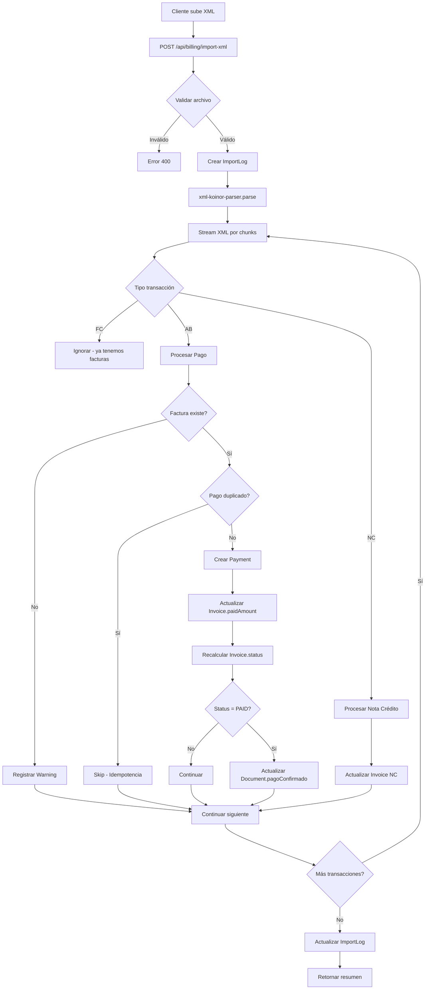

# Plan de Implementación: Parser XML de Pagos Koinor

**Fecha:** 28 de enero de 2026  
**Rama:** `feature/xml-payment-parser`  
**Prioridad:** ALTA  
**Complejidad:** Media-Alta

---

## 📋 RESUMEN EJECUTIVO

Implementar un sistema completo de importación de pagos desde archivos XML exportados del sistema Koinor, **reemplazando** la lógica actual basada en XLS. El nuevo sistema debe:

- ✅ Procesar archivos XML con 7000+ transacciones mediante streaming
- ✅ Mantener idempotencia absoluta (evitar duplicados)
- ✅ Actualizar automáticamente estados de facturas y documentos
- ✅ Manejar pagos multi-factura correctamente
- ✅ Soportar notas de crédito (NC)
- ✅ Ser retrocompatible durante 1 mes de transición

---

## 🎯 OBJETIVOS DEL PROYECTO

### Objetivo Principal
Crear un sistema robusto de procesamiento de pagos XML que:
1. Procese archivos grandes sin agotar memoria
2. Evite duplicados mediante idempotencia estricta
3. Actualice estados de forma coherente
4. Proporcione trazabilidad completa

### Objetivos Secundarios
- Deprecar el sistema XLS actual (sin eliminarlo)
- Mantener compatibilidad con frontend existente
- Documentar el proceso de migración
- Crear casos de prueba exhaustivos

---

## 🗄️ FASE 1: MIGRACIÓN DE BASE DE DATOS

### 1.1 Cambios en Schema Prisma

**Archivo:** `backend/prisma/schema.prisma`

#### Cambio 1: Agregar campo `paidAmount` a Invoice

**Ubicación:** Modelo `Invoice` (línea ~589)

```prisma
model Invoice {
  id                String        @id @default(uuid())
  
  // ... campos existentes ...
  
  // Montos
  totalAmount       Decimal       @db.Decimal(12, 2)  // valcob de FC
  paidAmount        Decimal?      @db.Decimal(12, 2) @default(0)  // 🆕 NUEVO CAMPO
  
  // ... resto del modelo ...
}
```

**Justificación:** Necesario para tracking incremental de pagos sin recalcular suma de payments cada vez.

#### Cambio 2: Remover constraint unique de `Payment.receiptNumber`

**Ubicación:** Modelo `Payment` (línea ~634)

**ANTES:**
```prisma
model Payment {
  id              String      @id @default(uuid())
  receiptNumber   String      @unique  // ❌ Eliminar @unique
  // ...
}
```

**DESPUÉS:**
```prisma
model Payment {
  id              String      @id @default(uuid())
  receiptNumber   String      // ✅ Sin @unique
  // ...
  
  @@index([receiptNumber])  // 🆕 Agregar índice no-único
}
```

**Justificación:** Un recibo puede pagar múltiples facturas. El mismo `receiptNumber` debe poder aparecer en varios registros Payment con diferente `invoiceId`.

### 1.2 Crear Migración

**Comando:**
```bash
cd backend
npx prisma migrate dev --name add_paidAmount_remove_payment_unique
```

**SQL Generado Esperado:**
```sql
-- AddPaidAmountRemovePaymentUnique
ALTER TABLE "invoices" ADD COLUMN "paidAmount" DECIMAL(12,2) DEFAULT 0;

ALTER TABLE "payments" DROP CONSTRAINT IF EXISTS "payments_receiptNumber_key";

CREATE INDEX IF NOT EXISTS "payments_receiptNumber_idx" ON "payments"("receiptNumber");
```

### 1.3 Validación Post-Migración

**Script de validación:** `backend/scripts/validate-xml-migration.js`

```javascript
// Verificar que:
// 1. Campo paidAmount existe en invoices
// 2. Constraint unique eliminado de payments
// 3. Índice no-único creado
// 4. Datos existentes migrados correctamente
```

---

## 🏗️ FASE 2: ARQUITECTURA DEL PARSER XML

### 2.1 Componentes del Sistema

```
┌──────────────────────────────────────────────────────────┐
│                   NUEVO SISTEMA XML                       │
├──────────────────────────────────────────────────────────┤
│                                                           │
│  ┌───────────────────────────────────────────────────┐  │
│  │ billing-controller.js                             │  │
│  │ - importXmlFile() // Nuevo endpoint               │  │
│  └─────────────────┬─────────────────────────────────┘  │
│                    │                                      │
│                    v                                      │
│  ┌───────────────────────────────────────────────────┐  │
│  │ import-koinor-xml-service.js (NUEVO)             │  │
│  │ - Orquestador principal                           │  │
│  │ - Manejo de transacciones DB                      │  │
│  │ - Lógica de actualización estados                 │  │
│  └─────────────────┬─────────────────────────────────┘  │
│                    │                                      │
│                    v                                      │
│  ┌───────────────────────────────────────────────────┐  │
│  │ xml-koinor-parser.js (NUEVO)                      │  │
│  │ - Streaming XML parser                            │  │
│  │ - Normalización de datos                          │  │
│  │ - Validaciones de estructura                      │  │
│  └─────────────────┬─────────────────────────────────┘  │
│                    │                                      │
│                    v                                      │
│  ┌───────────────────────────────────────────────────┐  │
│  │ billing-utils.js (EXTENDIDO)                      │  │
│  │ - Funciones de normalización                      │  │
│  │ - Validadores de datos                            │  │
│  │ - Helpers de estado                               │  │
│  └───────────────────────────────────────────────────┘  │
│                                                           │
└──────────────────────────────────────────────────────────┘

┌──────────────────────────────────────────────────────────┐
│                   SISTEMA XLS LEGACY                      │
├──────────────────────────────────────────────────────────┤
│  import-koinor-service.legacy.js                         │
│  (Deprecado - mantener 1 mes)                            │
└──────────────────────────────────────────────────────────┘
```

### 2.2 Flujo de Procesamiento



---

## 📦 FASE 3: IMPLEMENTACIÓN DE SERVICIOS

### 3.1 Parser XML por Streaming

**Archivo:** `backend/src/services/xml-koinor-parser.js`

**Dependencias:**
```json
{
  "xml-stream": "^0.5.0",  // Parser XML streaming
  "iconv-lite": "^0.6.3"   // Para UTF-16LE encoding
}
```

**Estructura de salida:**
```javascript
{
  payments: [
    {
      receiptNumber: "001-2601000305",
      clientTaxId: "1703601532",
      clientName: "NOMBRE CLIENTE",
      paymentDate: Date,
      type: "AB" | "NC",
      details: [
        {
          invoiceNumberRaw: "001002-00124369",
          amount: 2.36
        }
      ]
    }
  ],
  summary: {
    totalTransactions: 6926,
    paymentsFound: 3200,
    notasCreditoFound: 45,
    processedAt: Date
  }
}
```

**Funciones principales:**
```javascript
/**
 * Parsea archivo XML de Koinor por streaming
 * @param {Buffer} fileBuffer - Buffer del archivo XML
 * @param {string} fileName - Nombre del archivo
 * @returns {Promise<Object>} Resultado del parsing
 */
export async function parseKoinorXML(fileBuffer, fileName) {
  // 1. Detectar encoding (UTF-16LE)
  // 2. Crear stream
  // 3. Procesar por chunks
  // 4. Filtrar solo AB y NC
  // 5. Normalizar datos
  // 6. Retornar estructura procesada
}

/**
 * Valida estructura de un nodo de transacción
 */
function validateTransactionNode(node) {
  // Verificar campos obligatorios
  // Validar formatos
  // Retornar errores
}
```

### 3.2 Servicio de Importación XML

**Archivo:** `backend/src/services/import-koinor-xml-service.js`

**Funciones principales:**

#### `importKoinorXMLFile(fileBuffer, fileName, userId)`

```javascript
export async function importKoinorXMLFile(fileBuffer, fileName, userId) {
  // 1. Crear ImportLog
  const importLog = await prisma.importLog.create({...});
  
  try {
    // 2. Parsear XML
    const parsed = await parseKoinorXML(fileBuffer, fileName);
    
    // 3. Procesar pagos en transacciones
    const results = await processPayments(parsed.payments, fileName);
    
    // 4. Actualizar ImportLog con resultado
    await prisma.importLog.update({
      where: { id: importLog.id },
      data: {
        status: 'COMPLETED',
        ...results.stats
      }
    });
    
    return {
      success: true,
      importLogId: importLog.id,
      stats: results.stats
    };
  } catch (error) {
    // Actualizar con error
    await prisma.importLog.update({
      where: { id: importLog.id },
      data: { status: 'FAILED', errorDetails: error }
    });
    throw error;
  }
}
```

#### `processPayments(payments, sourceFile)`

```javascript
async function processPayments(payments, sourceFile) {
  const stats = {
    paymentsCreated: 0,
    paymentsSkipped: 0,
    invoicesUpdated: 0,
    documentsUpdated: 0,
    errors: []
  };
  
  for (const payment of payments) {
    try {
      // Procesar cada detalle (factura) del pago
      for (const detail of payment.details) {
        await processSinglePayment(payment, detail, sourceFile, stats);
      }
    } catch (error) {
      stats.errors.push({
        receiptNumber: payment.receiptNumber,
        error: error.message
      });
    }
  }
  
  return { stats };
}
```

#### `processSinglePayment(payment, detail, sourceFile, stats)`

```javascript
async function processSinglePayment(payment, detail, sourceFile, stats) {
  // 1. Buscar factura
  const invoice = await prisma.invoice.findFirst({
    where: { invoiceNumberRaw: detail.invoiceNumberRaw },
    include: { document: true }
  });
  
  if (!invoice) {
    stats.errors.push({
      invoiceNumberRaw: detail.invoiceNumberRaw,
      message: 'Factura no encontrada'
    });
    return;
  }
  
  // 2. Verificar idempotencia (CRÍTICO)
  const existingPayment = await prisma.payment.findFirst({
    where: {
      receiptNumber: payment.receiptNumber,
      invoiceId: invoice.id,
      amount: detail.amount,
      paymentDate: payment.paymentDate
    }
  });
  
  if (existingPayment) {
    stats.paymentsSkipped++;
    return; // Ya existe este pago específico
  }
  
  // 3. Crear Payment y actualizar Invoice en transacción
  await prisma.$transaction(async (tx) => {
    // Crear Payment
    await tx.payment.create({
      data: {
        receiptNumber: payment.receiptNumber,
        amount: detail.amount,
        paymentDate: payment.paymentDate,
        concept: payment.clientName,
        paymentType: 'TRANSFER', // Detectar del XML si es posible
        invoiceId: invoice.id,
        sourceFile
      }
    });
    
    // Actualizar paidAmount
    const currentPaid = parseFloat(invoice.paidAmount || 0);
    const newPaid = currentPaid + parseFloat(detail.amount);
    const totalAmount = parseFloat(invoice.totalAmount);
    
    // Calcular nuevo status
    let newStatus = invoice.status;
    if (newPaid >= totalAmount) {
      newStatus = 'PAID';
    } else if (newPaid > 0) {
      newStatus = 'PARTIAL';
    }
    
    // Actualizar Invoice
    await tx.invoice.update({
      where: { id: invoice.id },
      data: {
        paidAmount: newPaid,
        status: newStatus,
        lastSyncAt: new Date()
      }
    });
    
    // Si está PAID y tiene documento, actualizar pagoConfirmado
    if (newStatus === 'PAID' && invoice.documentId) {
      await tx.document.update({
        where: { id: invoice.documentId },
        data: { pagoConfirmado: true }
      });
      stats.documentsUpdated++;
    }
    
    stats.paymentsCreated++;
    stats.invoicesUpdated++;
  });
}
```

### 3.3 Extensiones a billing-utils.js

**Archivo:** `backend/src/utils/billing-utils.js`

**Nuevas funciones a agregar:**

```javascript
/**
 * Normaliza número de recibo de pago del XML
 * @param {string} raw - Número de recibo (numdoc)
 * @returns {string} - Recibo normalizado
 */
export function normalizeReceiptNumber(raw) {
  if (!raw || typeof raw !== 'string') {
    return null;
  }
  return raw.trim();
}

/**
 * Valida formato de número de recibo
 * @param {string} receiptNumber
 * @returns {boolean}
 */
export function validateReceiptNumber(receiptNumber) {
  // Formato esperado: 001-2601000305
  const pattern = /^\d{3}-\d{10}$/;
  return pattern.test(receiptNumber);
}

/**
 * Parsea fecha del XML (formato Koinor: "2026-01-19 00:00:00")
 * @param {string} dateString
 * @returns {Date|null}
 */
export function parseKoinorDate(dateString) {
  if (!dateString) return null;
  
  // Formato: "YYYY-MM-DD HH:MM:SS"
  const parsed = new Date(dateString);
  return isNaN(parsed.getTime()) ? null : parsed;
}

/**
 * Determina tipo de pago basado en contexto
 * (Por ahora siempre TRANSFER hasta tener más información)
 */
export function detectPaymentTypeFromXML(tipdoc, concep) {
  if (tipdoc === 'NC') {
    return 'CREDIT_NOTE';
  }
  // Por defecto transferencia
  return 'TRANSFER';
}
```

---

## 🔌 FASE 4: INTEGRACIÓN CON ENDPOINTS

### 4.1 Actualizar billing-controller.js

**Archivo:** `backend/src/controllers/billing-controller.js`

**Nuevo endpoint:**

```javascript
/**
 * Import Koinor XML file
 * Requires multipart/form-data with 'file' field
 */
export async function importXmlFile(req, res) {
  try {
    // Validar archivo
    if (!req.file) {
      return res.status(400).json({
        success: false,
        error: 'No se proporcionó archivo',
        message: 'Debe subir un archivo XML (.xml)'
      });
    }

    const { file } = req;
    const userId = req.user?.id;

    // Validar extensión
    const ext = file.originalname.toLowerCase().substring(
      file.originalname.lastIndexOf('.')
    );

    if (ext !== '.xml') {
      return res.status(400).json({
        success: false,
        error: 'Tipo de archivo no válido',
        message: 'Solo se permiten archivos XML'
      });
    }

    console.log(`[billing-controller] Starting XML import of ${file.originalname}`);

    // Importar servicio dinámicamente
    const { importKoinorXMLFile } = await import(
      '../services/import-koinor-xml-service.js'
    );

    // Procesar el archivo
    const result = await importKoinorXMLFile(
      file.buffer,
      file.originalname,
      userId
    );

    res.json({
      success: true,
      message: 'Importación XML completada',
      ...result
    });
  } catch (error) {
    console.error('[billing-controller] XML import error:', error);
    res.status(500).json({
      success: false,
      message: 'Error durante la importación del archivo XML',
      details: process.env.NODE_ENV === 'development' ? error.message : undefined
    });
  }
}
```

### 4.2 Actualizar billing-routes.js

**Archivo:** `backend/src/routes/billing-routes.js`

**Modificaciones:**

```javascript
// Configurar multer para XML
const xmlUpload = multer({
  storage: multer.memoryStorage(),
  limits: {
    fileSize: 50 * 1024 * 1024 // 50MB para XMLs grandes
  },
  fileFilter: (req, file, cb) => {
    const ext = file.originalname.toLowerCase().substring(
      file.originalname.lastIndexOf('.')
    );
    
    if (ext === '.xml') {
      cb(null, true);
    } else {
      cb(new Error('Solo se permiten archivos XML'), false);
    }
  }
});

// NUEVO ENDPOINT XML (a usar)
router.post(
  '/import-xml',
  csrfProtection,
  xmlUpload.single('file'),
  billingController.importXmlFile
);

// ENDPOINT XLS LEGACY (deprecar después de 1 mes)
// TODO: Comentar después del 28/02/2026
router.post(
  '/import',
  csrfProtection,
  upload.single('file'),
  billingController.importFile
);
```

---

## 🔒 FASE 5: SEGURIDAD E IDEMPOTENCIA

### 5.1 Estrategia de Idempotencia

**Combinación de campos para unicidad:**
```
receiptNumber + invoiceId + amount + paymentDate
```

**Justificación:**
- `receiptNumber` solo: ❌ No suficiente (pago multi-factura)
- `receiptNumber + invoiceId`: ❌ Falla si se corrige monto
- **Combinación de 4 campos**: ✅ Unicidad garantizada

**Implementación:**
```javascript
const existingPayment = await prisma.payment.findFirst({
  where: {
    receiptNumber: payment.receiptNumber,
    invoiceId: invoice.id,
    amount: detail.amount,
    paymentDate: payment.paymentDate
  }
});

if (existingPayment) {
  // Pago ya registrado - SKIP
  return { skipped: true };
}
```

### 5.2 Validaciones Obligatorias

**Nivel 1: Archivo**
- ✅ Archivo es XML válido
- ✅ Codificación UTF-16LE correcta
- ✅ Tamaño < 50MB

**Nivel 2: Estructura**
- ✅ Tiene nodo raíz `d_vc_i_estado_cuenta_row`
- ✅ Contiene nodos `d_vc_i_estado_cuenta_group1`

**Nivel 3: Datos**
- ✅ `codcli` presente y numérico
- ✅ `tipdoc` es FC, AB o NC
- ✅ `numtra` presente (número factura)
- ✅ `valcob` > 0
- ✅ `fecemi` es fecha válida

**Nivel 4: Negocio**
- ⚠️ Warning si factura no existe (no error)
- ⚠️ Warning si cliente no coincide
- ⚠️ Validar coherencia sigdoc (-) para pagos

### 5.3 Manejo de Errores

**Errores Fatales (detienen importación):**
- Archivo corrupto o no parseable
- Error de conexión DB
- Timeout de transacción

**Errores Recuperables (registran warning):**
- Factura no encontrada
- Datos inconsistentes
- Pagos duplicados (idempotencia)

**Logging:**
```javascript
console.log('[xml-import] Processing payment', {
  receiptNumber,
  invoiceNumberRaw,
  amount,
  action: 'created' | 'skipped' | 'error'
});
```

---

## ✅ FASE 6: TESTING Y VALIDACIÓN

### 6.1 Casos de Prueba Obligatorios

#### Test 1: Pago Simple (1 factura)
```javascript
// Input: AB con 1 numtra
// Expected:
// - 1 Payment creado
// - 1 Invoice actualizada (paidAmount, status)
// - Si PAID: Document.pagoConfirmado = true
```

#### Test 2: Pago Multi-Factura (2+ facturas)
```javascript
// Input: Mismo receiptNumber en múltiples group1
// Expected:
// - N Payments con mismo receiptNumber
// - N Invoices actualizadas independientemente
```

#### Test 3: Idempotencia (XML duplicado)
```javascript
// Input: Mismo XML subido 2 veces
// Expected:
// - Primera vez: N payments creados
// - Segunda vez: 0 payments creados (todos skipped)
```

#### Test 4: Factura No Encontrada
```javascript
// Input: AB con numtra inexistente
// Expected:
// - Warning registrado
// - Payment NO creado
// - Importación continúa
```

#### Test 5: Nota de Crédito
```javascript
// Input: NC para factura existente
// Expected:
// - Invoice.status actualizado
// - Document campos NC actualizados
```

#### Test 6: Archivo Grande (7000+ registros)
```javascript
// Input: XML real de producción
// Expected:
// - Procesamiento sin timeout
// - Memoria estable (streaming)
// - Tiempo < 2 minutos
```

### 6.2 Script de Pruebas

**Archivo:** `backend/scripts/test-xml-import.js`

```javascript
import { importKoinorXMLFile } from '../src/services/import-koinor-xml-service.js';
import fs from 'fs';

async function runTests() {
  console.log('🧪 Testing XML Import Service\n');
  
  // Test 1: Archivo pequeño
  const smallXML = fs.readFileSync('./test-data/small.xml');
  const result1 = await importKoinorXMLFile(smallXML, 'small.xml', 1);
  console.log('✅ Test 1 passed:', result1);
  
  // Test 2: Idempotencia
  const result2 = await importKoinorXMLFile(smallXML, 'small.xml', 1);
  assert(result2.stats.paymentsSkipped > 0, 'Should skip duplicates');
  console.log('✅ Test 2 passed: Idempotency works');
  
  // Test 3: Archivo grande
  const largeXML = fs.readFileSync('./test-data/112025-012026.xml');
  const result3 = await importKoinorXMLFile(largeXML, 'large.xml', 1);
  console.log('✅ Test 3 passed:', result3);
  
  console.log('\n✅ All tests passed!');
}

runTests().catch(console.error);
```

---

## 📝 FASE 7: DOCUMENTACIÓN

### 7.1 Documentación de Usuario

**Archivo:** `docs/GUIA_IMPORTACION_XML_PAGOS.md`

```markdown
# Guía de Importación de Pagos XML

## ¿Qué hace este sistema?
Importa pagos desde el sistema Koinor en formato XML...

## Cómo usar
1. Exportar XML desde Koinor
2. Ir a Panel de Facturación > Importar
3. Seleccionar "Importar XML" (nuevo)
4. Subir archivo
5. Revisar resumen

## Errores comunes
- "Factura no encontrada": Importar facturas primero
- "Archivo muy grande": Dividir en períodos menores

## FAQ
...
```

### 7.2 Documentación Técnica

**Archivo:** `backend/src/services/README-XML-IMPORT.md`

```markdown
# Servicio de Importación XML Koinor

## Arquitectura
[Diagrama de componentes]

## API
### parseKoinorXML(buffer, fileName)
...

## Mantenimiento
- Logs en `/var/log/notaria/xml-imports/`
- Monitorear ImportLog para errores
- Timeout configurado a 5 minutos

## Troubleshooting
...
```

---

## 🚀 FASE 8: DEPLOYMENT

### 8.1 Checklist Pre-Deploy

- [ ] Migración de DB aplicada en staging
- [ ] Tests unitarios pasando
- [ ] Test con XML real exitoso
- [ ] Documentación completa
- [ ] Variables de entorno configuradas
- [ ] Rollback plan documentado

### 8.2 Plan de Rollout

**Semana 1 (Staging):**
- Deploy a staging
- Pruebas con usuarios de caja
- Validar con 1 XML de producción

**Semana 2 (Producción - Beta):**
- Deploy a producción
- Habilitar endpoint `/import-xml`
- Mantener `/import` activo
- Usuarios clave prueban XML

**Semana 3-4 (Producción - Full):**
- Comunicar a todos los usuarios
- Migrar todos a XML
- Monitorear errores

**Semana 5+ (Deprecación XLS):**
- Comentar endpoint `/import`
- Renombrar `import-koinor-service.js` a `.legacy.js`
- Actualizar documentación

### 8.3 Rollback Plan

Si hay problemas críticos:

1. **Inmediato:** Reactivar endpoint XLS
2. **1 hora:** Revertir migración DB si es necesario
3. **4 horas:** Investigar causa raíz
4. **24 horas:** Fix y redeploy o continuar con XLS

---

## 📊 MÉTRICAS DE ÉXITO

### KPIs Técnicos
- ✅ Tiempo de procesamiento < 2 min para 7000 registros
- ✅ Uso de memoria < 500MB
- ✅ 0 duplicados detectados en producción
- ✅ 99.9% de pagos procesados correctamente

### KPIs de Negocio
- ✅ 100% de usuarios migrados a XML en 1 mes
- ✅ 0 quejas de pagos duplicados
- ✅ Reducción 50% en tiempo de importación vs XLS
- ✅ Trazabilidad completa de todas las operaciones

---

## 🔧 MANTENIMIENTO FUTURO

### Mejoras Planificadas
1. **Dashboard de importaciones:** Vista gráfica de ImportLog
2. **Alertas automáticas:** Notificar si importación falla
3. **Retry automático:** Reintentar transacciones fallidas
4. **Exportación reportes:** Generar CSV de discrepancias

### Deuda Técnica
- Detectar tipo de pago real del XML (cash/transfer/check)
- Soportar múltiples monedas si es necesario
- Optimizar queries con índices compuestos

---

## 📋 CHECKLIST DE IMPLEMENTACIÓN

### Base de Datos
- [ ] Agregar campo `paidAmount` a Invoice
- [ ] Remover constraint unique de Payment.receiptNumber
- [ ] Agregar índice no-único en Payment.receiptNumber
- [ ] Ejecutar migración en desarrollo
- [ ] Ejecutar migración en staging
- [ ] Validar migración con script

### Código Backend
- [ ] Crear `xml-koinor-parser.js`
- [ ] Crear `import-koinor-xml-service.js`
- [ ] Extender `billing-utils.js` con funciones XML
- [ ] Agregar endpoint `importXmlFile` en controller
- [ ] Actualizar rutas con `/import-xml`
- [ ] Instalar dependencias (xml-stream, iconv-lite)
- [ ] Deprecar servicio XLS (renombrar a .legacy.js)

### Testing
- [ ] Crear casos de prueba unitarios
- [ ] Crear script de test de integración
- [ ] Probar con XML pequeño (50 registros)
- [ ] Probar con XML real (7000 registros)
- [ ] Validar idempotencia (subir 2 veces)
- [ ] Probar errores (factura no encontrada)
- [ ] Validar memoria y performance

### Documentación
- [ ] Crear guía de usuario
- [ ] Documentar API técnica
- [ ] Actualizar README del proyecto
- [ ] Crear troubleshooting guide
- [ ] Documentar plan de rollback

### Deploy
- [ ] Deploy a staging
- [ ] Pruebas con usuario caja
- [ ] Deploy a producción (beta)
- [ ] Monitorear logs primera semana
- [ ] Migración completa de usuarios
- [ ] Deprecar endpoint XLS

---

## 📞 SOPORTE Y CONTACTO

**Desarrollador:** [Nombre]  
**Documentación:** `/docs/GUIA_IMPORTACION_XML_PAGOS.md`  
**Logs:** Ver `ImportLog` en base de datos  
**Alertas:** Revisar endpoint `/api/billing/import-logs`

---

## 🎓 CONCEPTOS CLAVE PARA DESARROLLADOR

### ¿Por qué Streaming?
Archivos de 7000+ registros pueden consumir mucha RAM si se cargan completamente en memoria. El streaming procesa el archivo por "chunks" (pedazos), manteniendo bajo uso de memoria.

### ¿Por qué Idempotencia?
Si un usuario sube el mismo archivo 2 veces por error, no queremos duplicar pagos. La idempotencia garantiza que la misma operación produce el mismo resultado sin importar cuántas veces se ejecute.

### ¿Por qué Transacciones?
Al crear un Payment y actualizar una Invoice, ambas operaciones deben ser atómicas. Si falla una, ambas deben revertirse para mantener consistencia de datos.

### ¿Por qué NO usar `concep`?
El campo `concep` es texto libre que puede variar. No es confiable para lógica de negocio. Usamos campos estructurados como `numtra`, `numdoc`, `valcob`.

---

**Fin del Plan de Implementación**

*Última actualización: 28 de enero de 2026*
